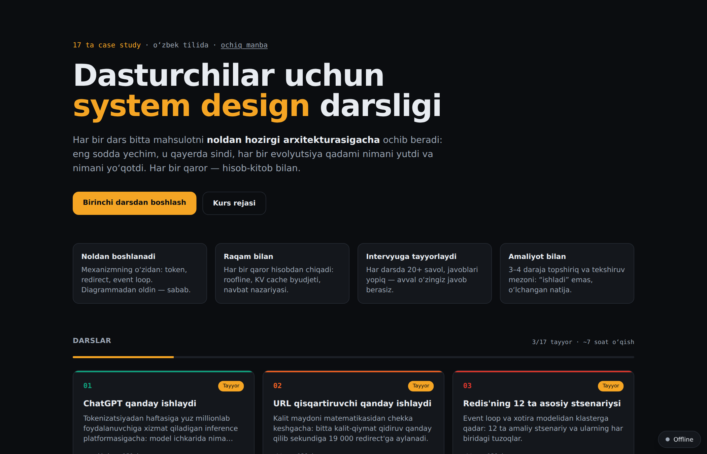
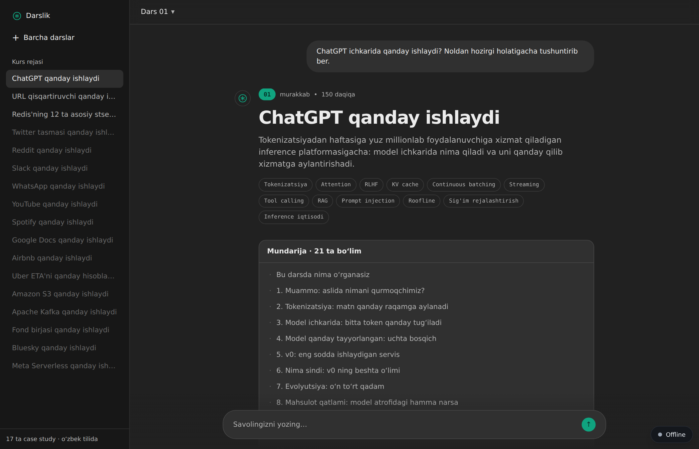
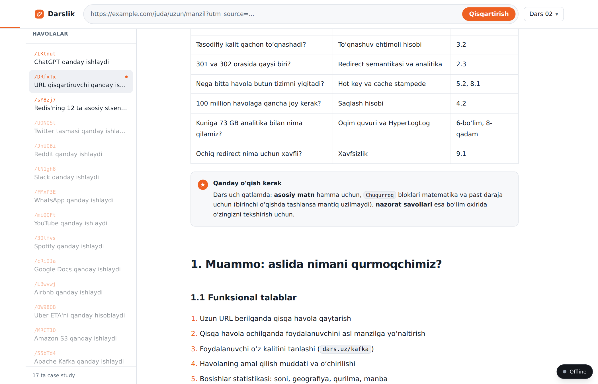
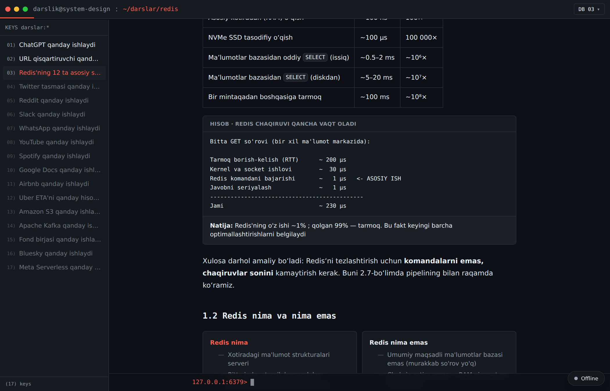

<div align="center">


# System Design darsligi

**Dasturchilar uchun tizim dizayni bo‘yicha o‘zbek tilidagi darslik.**
Har bir dars bitta mahsulotni noldan hozirgi arxitekturasigacha ochib beradi —
va har bir qaror hisob-kitob bilan asoslanadi.

[**→ Saytni ochish**](https://dinmuhammad.uz/15-case-studiesfo-software-engineers/)


</div>

<p align="center">
  
</p>

---

## Nima bu?

Tizim dizayni haqidagi ko‘p material ikkita xatodan birini qiladi: yo faqat quti-strelka
diagrammasini chizadi va ichkarida nima bo‘layotganini tushuntirmaydi, yo aksincha —
nazariyaga botib, uni real mahsulotga bog‘lamaydi.

Bu darslikda har bir mavzu **bir xil yo‘ldan** boradi:

| Bosqich | Nima beradi |
| --- | --- |
| **Nol nuqta** | Mexanizmning o‘zi: token, HTTP redirect, event loop. Diagrammadan oldin — sabab |
| **v0** | Eng sodda ishlaydigan yechim — “yomon” emas, shunchaki kichik |
| **Nima sindi** | Aniq raqam bilan: `500 token × 42 ms = 21 soniya` |
| **Evolyutsiya** | 12–14 qadam, har birida **nima yutdik va nimani yo‘qotdik** |
| **Bugungi arxitektura** | To‘liq diagramma va so‘rovning kechikish byudjeti |
| **Ishonchlilik** | Nosozliklar taksonomiyasi va degradatsiya tartibi |
| **Iqtisod** | Bitta operatsiya necha tsentga tushadi |
| **Intervyu** | 20+ savol, javoblari yopiq — avval o‘zingiz javob berasiz |
| **Amaliyot** | 3–4 daraja topshiriq va **tekshiruv mezoni** |

Har bir darsda ~19 ta **hisob-kitob bloki** bor: farazlar → arifmetika → xulosa. Ularni
kalkulyatorda takrorlash mumkin.

## Darslar

| № | Dars | Holat | Hajm | Nimani o‘rgatadi |
| --- | --- | --- | --- | --- |
| 01 | [ChatGPT qanday ishlaydi](https://dinmuhammad.uz/15-case-studiesfo-software-engineers/darslar/chatgpt/) | ✅ Tayyor | 12 200 so‘z | Tokenizatsiya, attention, KV cache, continuous batching, roofline, inference iqtisodi |
| 02 | [URL qisqartiruvchi](https://dinmuhammad.uz/15-case-studiesfo-software-engineers/darslar/url-shortener/) | ✅ Tayyor | 16 400 so‘z | Base62, Feistel, tug‘ilgan kun paradoksi, Zipf va yarim yemirilish, cache stampede, Bloom filtri, goo.gl saboqi |
| 03 | [Redis: 12 ta stsenariy](https://dinmuhammad.uz/15-case-studiesfo-software-engineers/darslar/redis/) | ✅ Tayyor | 14 800 so‘z | Event loop, xotira modeli, TTL va eviction, fork/COW, skiplist va HyperLogLog ichidan, Streams, klaster, Valkey |
| 04 | [Twitter tasmasi](https://dinmuhammad.uz/15-case-studiesfo-software-engineers/darslar/twitter/) | ✅ Tayyor | 10 200 so‘z | Fan-out on write vs read, mashhur akkauntlar, tasma keshi, reyting |
| 05 | [Reddit](https://dinmuhammad.uz/15-case-studiesfo-software-engineers/darslar/reddit/) | ✅ Tayyor | 14 000 so‘z | Ovoz berish, kommentariya daraxti, “hot” reytingi, moderatsiya |
| 06 | [Slack](https://dinmuhammad.uz/15-case-studiesfo-software-engineers/darslar/slack/) | ✅ Tayyor | 19 500 so‘z | WebSocket shlyuzlari, presence, kanal tarixi, yetkazish tartibi |
| 07 | [WhatsApp](https://dinmuhammad.uz/15-case-studiesfo-software-engineers/darslar/whatsapp/) | ✅ Tayyor | 20 000 so‘z | E2E shifrlash (Signal protokoli), yetkazish kafolati, oflayn navbat |
| 08 | [YouTube](https://dinmuhammad.uz/15-case-studiesfo-software-engineers/darslar/youtube/) | ✅ Tayyor | 19 000 so‘z | Transkodlash, CDN, adaptiv bitreyt, tavsiyalar |
| 09 | [Spotify](https://dinmuhammad.uz/15-case-studiesfo-software-engineers/darslar/spotify/) | ✅ Tayyor | 20 000 so‘z | Audio yetkazish, tinglashlar hisobi, tavsiya tizimi |
| 10 | [Google Docs](https://dinmuhammad.uz/15-case-studiesfo-software-engineers/darslar/google-docs/) | ✅ Tayyor | 19 000 so‘z | OT va CRDT, Jupiter protokoli, hujjat egasi, siqish |
| 11 | [Airbnb](https://dinmuhammad.uz/15-case-studiesfo-software-engineers/darslar/airbnb/) | ✅ Tayyor | 19 500 so‘z | Tun modeli, ikki marta bron bo‘lmasligi, idempotent to‘lovlar, geo qidiruv |
| 12 | [Uber ETA](https://dinmuhammad.uz/15-case-studiesfo-software-engineers/darslar/uber-eta/) | ✅ Tayyor | 19 000 so‘z | Yo‘l grafi, A* va Contraction Hierarchies, jonli tirbandlik, H3, DeepETA |
| 13 | [Amazon S3](https://dinmuhammad.uz/15-case-studiesfo-software-engineers/darslar/amazon-s3/) | ✅ Tayyor | 18 500 so‘z | 11 ta to‘qqiz, uch nusxa va erasure coding, metadata indeksi, kuchli izchillik, nazorat summalari |
| 14 | [Apache Kafka](https://dinmuhammad.uz/15-case-studiesfo-software-engineers/darslar/kafka/) | ✅ Tayyor | 17 500 so‘z | Commit log, partition, ISR va high watermark, consumer group, exactly-once, KRaft |
| 15 | [Fond birjasi](https://dinmuhammad.uz/15-case-studiesfo-software-engineers/darslar/stock-exchange/) | ✅ Tayyor | 17 500 so‘z | Buyurtmalar kitobi, matching engine, sekvenser va deterministik jurnal, bozor ma’lumotlari oqimi, adolat |
| 16 | [Bluesky](https://dinmuhammad.uz/15-case-studiesfo-software-engineers/darslar/bluesky/) | ✅ Tayyor | 16 500 so‘z | AT Protocol, imzolangan repo va MST, DID va handle, firehose, relay va AppView, maxsus feed’lar |
| 17 | [Meta Serverless](https://dinmuhammad.uz/15-case-studiesfo-software-engineers/darslar/meta-serverless/) | ✅ Tayyor | 15 500 so‘z | XFaaS, sovuq start va universal ishchi, muddat va kvota bilan rejalashtirish, vaqt bo‘yicha surish, AIMD |

## Har bir dars o‘z UI‘sida

Dars sahifasining dizayni o‘sha mahsulot interfeysidan ilhomlangan — bu shunchaki bezak
emas, mavzuga kirishishga yordam beradi.

<p align="center">
  
  
</p>
<p align="center">
  
</p>

> **Huquqiy eslatma.** Rasmiy logotip, shrift va brend materiallari ishlatilmagan —
> faqat o‘xshash palitra, tartib va o‘zimiz chizgan soddalashtirilgan belgilar. Har bir
> dars sahifasi pastida shu haqda izoh bor. Barcha tovar belgilari o‘z egalariga tegishli.

## Imkoniyatlar

- 📱 **Offline ishlaydi** — service worker barcha darslarni keshlaydi, internetsiz o‘qish mumkin
- 📲 **Ilova sifatida o‘rnatiladi** (PWA) — telefon yoki kompyuterga
- 🎨 **Har dars o‘z skinida** — 12 ta CSS tokeni ustiga qurilgan tizim
- 🧮 **Hisob-kitob bloklari** — har bir arxitektura qarori raqamdan chiqadi
- 🧭 **Avtomatik mundarija** — skroll bo‘yicha joriy bo‘lim ajratiladi
- ⚡️ **To‘liq statik** — server yo‘q, GitHub Pages‘da bepul turadi

## Ishga tushirish

```bash
git clone https://github.com/dinmuhammad05/15-case-studiesfo-software-engineers.git
cd 15-case-studiesfo-software-engineers
npm install
npm run dev          # http://localhost:3000
```

```bash
npm run build        # statik sayt -> out/ (+ manifest, service worker, sitemap)
npm run typecheck
```

## Loyiha tuzilishi

```
app/
  page.tsx                    bosh sahifa
  darslar/page.tsx            kurs rejasi
  darslar/<slug>/
    page.mdx                  dars matni
    theme.css                 shu darsning skin tokenlari
    layout.tsx                skinni ulaydi + OG metadata
components/
  lesson/                     barcha darslar uchun umumiy bloklar
  skins/                      har bir mahsulotning UI chrome'i
  pwa/                        offline rejim boshqaruvi
lib/
  lessons.ts                  darslar reyestri
  site.ts                     muallif, havolalar, litsenziya
scripts/
  yangi-dars.mjs              yangi dars skeletini yaratadi
  build-pwa.mjs               manifest, service worker, sitemap
  make-og.mjs / make-icons.mjs  ulashish rasmlari va ikonkalar
docs/DARS-SHABLONI.md         dars yozish qoidalari va hajm mezoni
```

## Yangi dars qo‘shish

1. `lib/lessons.ts` ga yozuv qo‘shing
2. `node scripts/yangi-dars.mjs <slug>` — skelet yaratiladi
3. `page.mdx` ni [`docs/DARS-SHABLONI.md`](docs/DARS-SHABLONI.md) bo‘yicha to‘ldiring
4. `theme.css` va `<Nom>Shell.tsx` ni mahsulot UI‘siga moslang
5. Statusni `tayyor` ga o‘zgartiring va PR oching

Chuqurlik mezoni: ~10 000+ so‘z, 15+ hisob bloki, 20+ intervyu savoli. Eng muhim qoida —
**har bir muhandislik qarori raqamdan kelib chiqsin**: “batching kerak” emas, balki
“arifmetik intensivlik 1, ridge point 295, demak GPU‘ning 0.3% i ishlatilyapti”.

## Hissa qo‘shish

Xato topsangiz, aniqlik kiritmoqchi bo‘lsangiz yoki yangi dars yozmoqchi bo‘lsangiz —
[issue oching](https://github.com/dinmuhammad05/15-case-studiesfo-software-engineers/issues)
yoki PR yuboring. Ayniqsa qadrlanadi:

- Texnik aniqlik xatolari va eskirgan raqamlar
- Til va uslub tuzatishlari
- Yangi darslar (avval issue orqali kelishib olamiz)

PR yuborsangiz, hissangiz shu litsenziyalar ostida qo‘shilishiga rozilik bildirgan
bo‘lasiz.

## Foydalanish shartlari

Darslik **bepul** va o‘qish uchun ochiq. Lekin uni pul ishlash vositasiga aylantirish
mumkin emas.

**Mumkin:**

- O‘qish, o‘rganish, do‘stlarga ulashish
- Universitet yoki bepul o‘quv kursida foydalanish
- Nom va manba ko‘rsatgan holda parchalarni keltirish, tarjima qilish

**Mumkin emas:**

- Dars matnlarini pullik kursga qo‘shish yoki sotish
- Reklama daromadi olish uchun o‘z saytingizda qayta nashr qilish
- Muallif nomini olib tashlab, o‘zingiznikidek ko‘rsatish

| Nima | Litsenziya |
| --- | --- |
| Dars matnlari, rasmlar, uslubiy hujjatlar | [CC BY-NC 4.0](LICENSE-CONTENT) — nom ko‘rsatilsa, **notijorat** maqsadda erkin |
| Manba kodi (sayt karkasi) | [MIT](LICENSE) |

Tijorat maqsadida foydalanish uchun muallif bilan bog‘laning:
[@dinMuhammad05](https://t.me/dinMuhammad05)

## Muallif

**[@dinmuhammad05](https://github.com/dinmuhammad05)** · Telegram:
[@dinMuhammad05](https://t.me/dinMuhammad05)

Loyiha foydali bo‘lsa — ⭐️ qo‘yib ketsangiz, boshqalar ham topadi.
